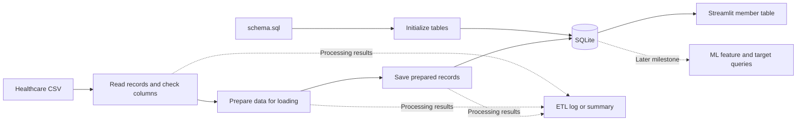

# Milestone 1 data flow

Milestone 1 will read the selected healthcare CSV, prepare the relevant member
fields, save the resulting records in SQLite, and display those records in
Streamlit. The diagram describes planned behavior; these steps are not yet
implemented in the current scaffold.

## Responsibilities

| Module | Planned role |
| --- | --- |
| `config.py` | Share input paths, database paths, and settings |
| `cli.py` | Accept file paths and start the import for initial testing |
| `etl/extract.py` | Read the CSV and check required columns |
| `etl/transform.py` | Select relevant fields and apply agreed cleaning rules |
| `etl/pipeline.py` | Run the steps in order and produce processing results |
| `db/schema.sql` | Define the agreed SQLite tables and constraints |
| `db/repository.py` | Create tables, save records, and read stored information |
| `ui/app.py` | Display the stored member records and relevant features |

The command line will support initial testing. Streamlit is the milestone 1
user interface. CSV upload through Streamlit has not been specified.

Milestone 1 implements all three ETL stages and the explicit SQL schema.
Pandas reads the CSV; transformation applies documented cleaning and type
rules; the repository initializes tables from `schema.sql` and loads accepted
records without replacing the defined schema. Streamlit reads the resulting
SQL data. Categories remain readable text; later ML code performs any
model-specific encoding. See [ETL rules](etl-rules.md).

## Processing results

The milestone requires a basic ETL processing log or summary. It should make
the import outcome understandable and support checking the populated SQL data.

**Pending for Milestone 1:** implement input identity, processing counts,
validation reasons, and final load status. Document the output location and
reconcile counts with SQL results. Define missing-value, duplicate, repeat-import,
and rollback behavior; see [ETL rules](etl-rules.md).

## Extending the prototype

The client requires the prototype to be designed for multiple data sources,
populations, and healthcare markets. Production latency, availability, and
infrastructure requirements are outside the project's scope.

Milestone 1 starts with a local CSV. Keep source-specific reading and field
mapping separate from the steps that save and display prepared member records.
This structure should let a later CSV, API, or other source supply data through
its own reading and mapping code while sharing the agreed member format and
database functions. Define and implement that shared SQL format during
Milestone 1.

Document differences in source fields and population-specific rules as they
are agreed on. A live Kaggle connection, production services, and performance
targets are not required for this milestone.

## Current behavior

`uv run mh-risk-outreach` only prints `Hello from mh-risk-outreach!`.
The baseline test checks that greeting. No CSV import, database creation,
processing summary, or Streamlit display runs yet.

See [project structure](project-structure.md), [database architecture](database.md),
and [milestone verification](verification.md).
